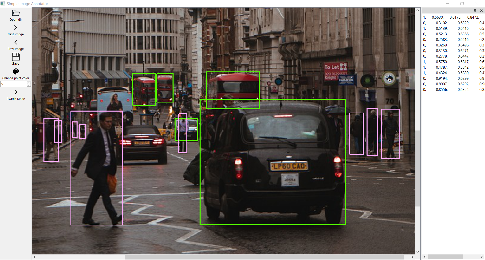
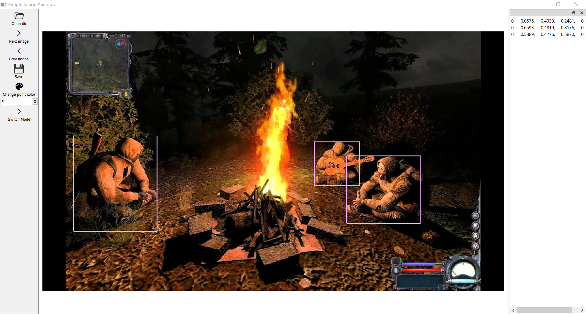
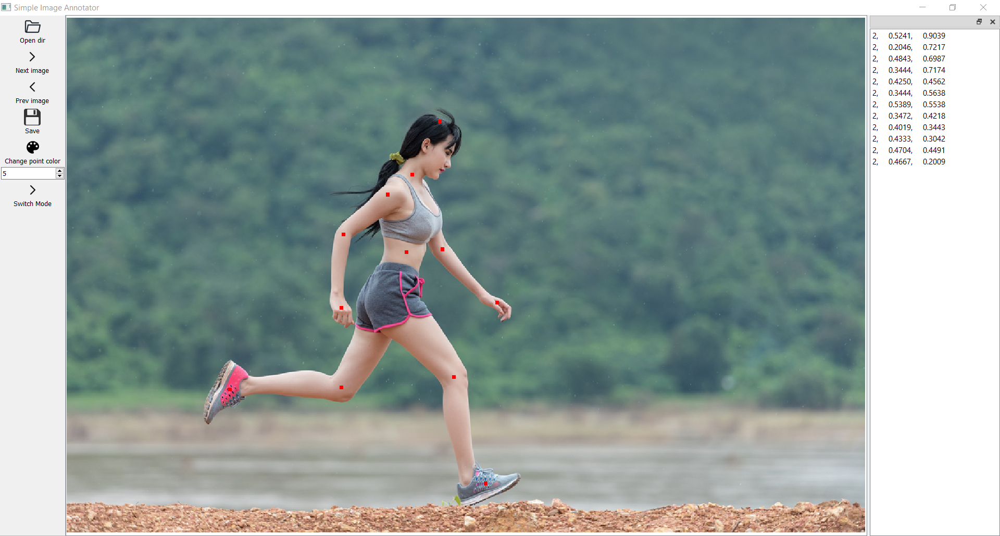

# Simple Image Annotator

**Simple Image Annotator** is an easy-to-use app designed to label key points and bounding boxes on images. It can be used for object detection, facial recognition, and other tasks that involve intricate image labeling.

# Installation

## Prerequisites

You need to have one of the following installed:

- Python 3.8 or higher
- Anaconda or Miniconda

## Instructions

1. Clone the repository:

```
git clone https://github.com/Pajpaje/keypoint-annotator
```

2. Install the required dependencies:

If you're using Anaconda or Miniconda, run:

```
conda install -c conda-forge pyside6
conda install -c anaconda pillow
```

If you're using standard Python installation, run:

```
pip install PySide6
pip install Pillow
```

# Usage

1. Run the app
2. Select the directory with the images that you want to label.
3. Create classes.txt file with the names of your classes
4. Label the key points and/or bounding boxes.
5. Save the labeled image.
6. Move to the next image.
7. Repeat the labeling process until all images are labeled.

# Examples

Here are some examples of how the app can be used:





# License

This project is licensed under the GNU GENERAL PUBLIC LICENSE - see the [LICENSE](LICENSE) file for details.
